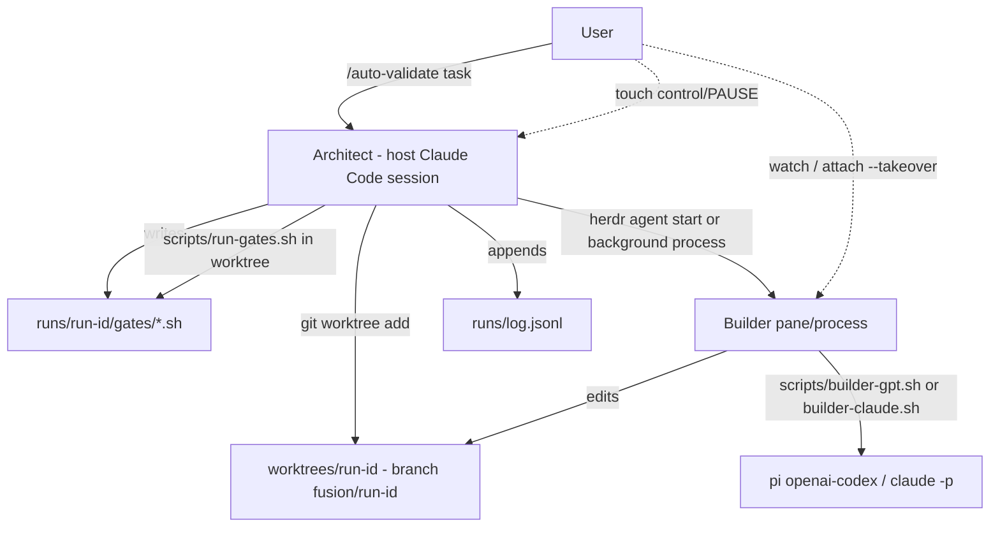
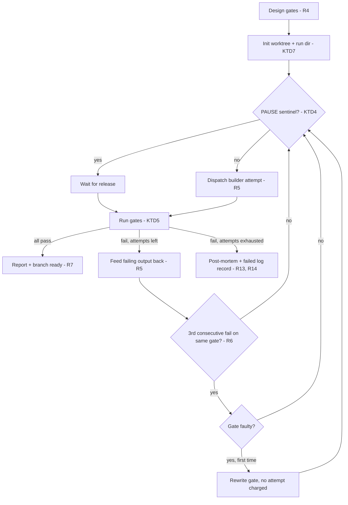

# Subscription Fusion Harness - Plan

## Goal Capsule

- **Objective:** Build v1 of a two-model agentic harness hosted in Claude Code, with `/auto-validate` as the sole command: the architect designs acceptance gates before work starts and a selectable builder iterates in isolation until the gates pass.
- **Product authority:** The Product Contract below; its Key Decisions KD1–KD9 are session-settled and not renegotiable during implementation. Personal experiment rig for a single user; the Q&A commands (`/opinion`, `/fusion`) and the deterministic runner are known follow-ons, not active scope.
- **Execution profile:** Greenfield repo. Deliverables are a project skill, prompt templates, and small leaf helper scripts — no daemon, no CI pipeline in v1.
- **Stop conditions:** Surface as a blocker rather than working around it if (a) pi's `openai-codex` subscription auth stops working headless, (b) Herdr's CLI surface differs materially from KTD6's verified commands, or (c) evidence invalidates any session-settled decision.
- **Tail ownership:** The calling pipeline owns commit, PR, and CI after implementation.

---

## Product Contract

### Summary

A prompt-driven port of disler's fusion-harness with Claude Code as host and architect, running entirely on existing subscriptions: Claude Code on the Claude plan, and pi's `openai-codex` provider on the Codex plan. v1 delivers `/auto-validate` — gates designed up front, a builder (gpt-5.6-sol via pi, or a clean-room Claude subprocess) iterating in a git worktree inside a visible Herdr pane until the gates pass.

### Problem Frame

The upstream fusion-harness runs on pi as host and requires pay-as-you-go API keys for both Anthropic and OpenAI. The user already pays for a Claude subscription (Claude Code) and a Codex subscription (pi's `openai-codex` provider), so PAYG keys duplicate cost for capacity already owned. Headless pi with Codex subscription auth was verified working in this session.

The failure mode motivating `/auto-validate` first: an agent claims a task is done when it isn't — tests fail or the feature doesn't actually work — forcing the user to babysit runs instead of walking away.

### Key Decisions

- KD1. **Subscription-only auth** (session-settled: user-directed — chosen over PAYG API keys: the point of the port; capacity is already paid for). Governs R1.
- KD2. **Claude is always the architect; the builder is selectable per run** (session-settled: user-directed — chosen over fixed GPT-builder or per-run role swapping: keeps orchestration in the host while making the builder model an experiment axis). Governs R3.
- KD3. **Builder works in a git worktree** (session-settled: user-approved — chosen over editing the working tree in place: walk-away safety; an off-the-rails run never touches the user's checkout). Governs R7.
- KD4. **Herdr pane observability from v1, with headless fallback** (session-settled: user-directed — chosen over headless-with-summaries as the default: live watching and takeover are wanted from day one). Governs R8, R9, R10.
- KD5. **Prompt-driven playbook first, deterministic runner second** (session-settled: user-approved — A→B staged over building the runner now: learn what the loop needs before encoding it; artifact formats are designed so the runner can absorb the inner loop without redesign). Governs R2, R12.
- KD6. **v1 ships `/auto-validate` only** (session-settled: user-approved — the primary success criterion is less babysitting, which only the validate loop tests).
- KD7. **v1 runs only against the harness repo itself** (session-settled: user-directed — chosen over a target-repo argument: prove the loop on sample tasks before spending on real-work ergonomics).
- KD8. **Gates are executable only** (session-settled: user-approved — chosen over adding an architect-judgment gate: pass/fail is never a matter of opinion, which is what keeps the loop honest). Governs R4.
- KD9. **Every run appends to a structured run log** (session-settled: user-approved — chosen over post-mortems-only or chat-only: cross-builder comparison must be greppable, and the log doubles as the v2 runner's format). Governs R14.

### Requirements

**Auth and models**

- R1. Every model call runs on subscription auth: the architect is the hosting Claude Code session (or a spawned `claude` subprocess), and the GPT builder uses pi's `openai-codex` provider. The harness never requires or reads `ANTHROPIC_API_KEY` or `OPENAI_API_KEY`.

**Validate loop**

- R2. The harness is a prompt-driven playbook: skill instructions, prompt templates, and gate/log conventions — no orchestration daemon in v1.
- R3. The builder is selectable per invocation — gpt-5.6-sol via pi (default) or a clean-room Claude subprocess — with everything else about the run identical, so results are comparable across builders.
- R4. The architect designs executable acceptance gates — scripts or commands with exit-code pass/fail semantics — before the builder does any work; gates are the definition of done for the run.
- R5. The builder iterates against the gates until they pass or a configurable maximum number of attempts is reached; each iteration receives the failing gate output.
- R6. When the same gate fails on the builder's third consecutive attempt, the architect re-diagnoses; if the gate itself is judged faulty, the architect rewrites it — at most once per run — without consuming a builder attempt.

**Isolation and results**

- R7. The builder works on a branch in a dedicated git worktree; the user's working tree is never modified. A passing run leaves the diff on its branch awaiting the user's review and merge — a deliberate manual step.

**Observability and control**

- R8. The builder runs inside a Herdr pane the user can watch live.
- R9. Taking over the builder's pane pauses the loop; on release, the architect re-runs the gates and resumes iteration from the code as the user left it.
- R10. When Herdr is not running at invocation, the run falls back to headless execution with per-iteration outcome summaries in chat rather than refusing to start.
- R11. Interrupting the run kills all spawned builder subprocesses and leaves the worktree intact for inspection.

**Forward compatibility**

- R12. Gate format, prompt templates, and run logs are defined as stable artifacts so a v2 deterministic runner can take over the inner loop without redesigning them.

**Run outcomes and records**

- R13. A run that exhausts its attempts without passing ends with an architect-written post-mortem — which gates failed, why the builder appears stuck, suggested next step — and leaves the worktree and branch with the best attempt for inspection.
- R14. Every run, pass or fail, appends a structured record to a run log in the repo: task, builder, attempt count, per-gate outcomes, duration, and token/cost stats.

### Key Flows

- F1. Validated build
  - **Trigger:** User invokes `/auto-validate` with a task description (and optionally a builder choice).
  - **Steps:** Architect writes gates → creates worktree and branch → launches builder in a Herdr pane → after each builder turn, runs gates → on failure, feeds results back for the next attempt → on pass, reports and points at the branch.
  - **Outcome:** Verified-passing diff on a branch; user reviews and merges.
  - **Covers:** R3, R4, R5, R7, R8.
- F2. Live takeover
  - **Trigger:** User grabs the builder's pane mid-run.
  - **Steps:** Architect detects takeover and stops dispatching → user edits freely → user releases the pane → architect re-runs gates and resumes iteration from the current state.
  - **Outcome:** Human edits become part of the iteration; the loop continues.
  - **Covers:** R9.
- F3. Gate repair
  - **Trigger:** Same gate fails the builder's third consecutive attempt.
  - **Steps:** Architect re-diagnoses → gate judged faulty → gate rewritten (once per run) → loop continues without charging a builder attempt.
  - **Outcome:** A bad gate cannot burn the run's attempt budget.
  - **Covers:** R6.

### Acceptance Examples

- AE1. **Covers R5.** Given gates exist and the builder's change fails gate 2, when the iteration completes, then the builder's next attempt receives gate 2's failing output and the attempt counter increments.
- AE2. **Covers R6.** Given the same gate has failed three consecutive attempts, when the architect judges the gate faulty, then the gate is rewritten once, the attempt counter does not increment, and a second faulty-gate verdict in the same run halts the loop for the user instead of rewriting again.
- AE3. **Covers R9.** Given a loop is mid-iteration, when the user takes over the pane, then no new builder turn is dispatched until release, and the first action after release is a gate run against the user's edits.
- AE4. **Covers R10.** Given Herdr is not running, when `/auto-validate` is invoked, then the run proceeds headless and each iteration's gate results are summarized in chat.
- AE5. **Covers R11.** Given a loop is running, when the user interrupts, then no builder process survives and the worktree remains on disk with its branch intact.
- AE6. **Covers R13, R14.** Given the final allowed attempt fails a gate, when the run ends, then a post-mortem exists, the branch holds the best attempt, and the run log has a record marked failed with per-gate outcomes.

### Success Criteria

- Primary: tasks handed to `/auto-validate` come back verified-working more often than solo-Claude runs — the "claims done, isn't" failure mode is absorbed by the gates.
- Zero marginal cost: sustained use stays within both subscriptions with no PAYG charges and no rate-limit pain that makes runs unusable.
- Ergonomics: the harness is low-friction enough that it gets reached for in real work, not just demos.
- Secondary: cross-builder comparisons (same task, different builder) surface blind-spot differences worth keeping the two-model pattern for.

### Scope Boundaries

Deferred for later:

- `/opinion` and `/fusion` — follow once the validate loop proves out.
- Running against arbitrary target repos (a target-repo argument or global skill install) — v1 operates only on the harness repo's own sample tasks.
- Architect-judgment gates (e.g., a final code-quality verdict after executable gates pass).
- Deterministic runner owning the inner loop (v2 of the staged approach).
- Plugin packaging or any distribution beyond this repo.
- Role flip (GPT as architect) or fusion-style dual builders competing on one task.
- Event-driven takeover detection via Herdr socket subscriptions — v1 uses the sentinel-file protocol in KTD4.

Rejected:

- Driving an interactive pi TUI via screen-scraping as the control channel — the pane is for human eyes; the control channel stays `--mode json`.

### Dependencies / Assumptions

- pi installed with working `openai-codex` subscription auth — verified this session (headless `--mode json -p` call succeeded with zero API-key involvement).
- Herdr installed with its socket API available for pane creation, takeover detection, and kill; absence degrades to headless per R10.
- Assumption: sustained builder iterations stay within Codex subscription limits — testing this is itself part of the zero-marginal-cost criterion.
- Assumption: long builder turns can run as background processes under the host without timing out the loop (the adapter's own per-turn timeout in KTD2 bounds a hung turn).
- jq (state and log-record edits) and shellcheck (verification) installed — both verified present.

---

## Planning Contract

**Product Contract preservation:** unchanged, except the former Outstanding Questions section — all five entries were `Deferred to Planning` and are resolved by KTD1–KTD5 below — and one Scope Boundaries addition (event-driven takeover detection deferred, per KTD4).

### Key Technical Decisions

- KTD1. **Invocation surface: project skill `auto-validate`** at `.claude/skills/auto-validate/SKILL.md`, taking a free-text task plus optional `builder:gpt|claude` and `max:N` tokens (defaults: `gpt`, `5`). A project skill keeps v1 scoped to this repo per KD7 and is the natural Claude Code entry point for a prompt-driven playbook (KD5).
- KTD2. **Builder adapters are thin scripts with one contract** (session-settled: inherits KD2, governs how R3 is instantiated). `scripts/builder-gpt.sh` wraps `pi --provider openai-codex --model gpt-5.6-sol --mode json -p` with clean-room flags (`--no-extensions --no-skills --no-context-files`) and a per-run `--session-dir` (`--continue` on later attempts); `scripts/builder-claude.sh` wraps `claude -p --output-format json --safe-mode` (customizations disabled, subscription OAuth intact) with session resume — never `--bare`, which restricts auth to `ANTHROPIC_API_KEY` and violates R1. Both take (worktree path, prompt file, run id) and write their JSON result — final text, exit status, usage/cost — to `runs/<run-id>/iterations/NN.json`, the authoritative result channel; stdout and the pane are human-facing only. Each turn runs under a timeout (default 1800s; on expiry the turn's process group is killed and a JSON error result is written). The shared contract is what makes runs comparable across builders (R3) and is the v2 runner's dispatch interface (R12).
- KTD3. **Attempt budget: default 5, per-run override** via the `max:N` invocation token. Consecutive-failure counting for gate repair (R6) is per-gate, tracked in the run's state file.
- KTD4. **Takeover protocol: sentinel file, not event subscription.** `runs/<run-id>/control/PAUSE` is the authoritative pause signal — the user (or a Herdr keybinding) creates it; the architect checks it before dispatching each builder turn; deleting it releases, and the first post-release action is a gate run (R9). `herdr agent attach <builder> --takeover` remains the documented way to grab the pane; the sentinel makes pause state deterministic without socket event plumbing. Event-driven detection is deferred (Scope Boundaries).
- KTD5. **Gate execution: repo-native scripts, no runtime manager.** Gates are executable files at `runs/<run-id>/gates/NN-<name>.sh` (any shebang), run sequentially in the worktree by `scripts/run-gates.sh`, which emits a JSON results array (gate, exit code, duration, tail of output). Exit 0 is pass (R4/KD8). Each gate runs under a timeout (default 300s; on expiry the gate's process group is killed and its result records failed with a timeout marker). No `uv` or other upstream runtime dependency.
- KTD6. **Herdr integration through its CLI, verified surface** (inherits KD4, governs how R8–R10 are instantiated). Launch: `herdr agent start <name> --cwd <worktree> -- <adapter-cmd>`; dispatch attempts 2..N into the same pane with `herdr pane run <pane-id> <adapter-cmd>`; detect turn completion by the appearance of the attempt's `iterations/NN.json` result file (per KTD2 — `herdr pane read` serves human narration, never parsing); terminate: `herdr pane close`. Availability check: `herdr status` reports a running server (socket at `~/.config/herdr/herdr.sock`); when absent, the same builder command runs as a host background process (R10) — identical adapter, different container.
- KTD7. **Run artifacts layout, shared with the v2 runner** (inherits KD9, governs how R12–R14 are instantiated). Per-run directory `runs/<run-id>/` holds `task.md`, `gates/`, `state.json` (attempt counters, per-gate failure streaks, pause state), `iterations/NN.json` (per-turn builder output), and `post-mortem.md` on exhaustion (R13). `runs/log.jsonl` gets one appended record per run (R14). Worktrees live at `worktrees/<run-id>` on branch `fusion/<run-id>`, created with plain `git worktree add` — no Herdr worktree helpers, so isolation works identically in headless fallback.
- KTD8. **pi builder session persists across attempts within a run** via a per-run `--session-dir runs/<run-id>/pi-session` plus `--continue` on later attempts: each retry continues the same builder conversation, so the builder keeps its own context of prior failures instead of rediscovering them. Fresh session per run. The Claude adapter mirrors this, but its session ids must be UUIDs: it generates one on the run's first turn, stores it in `runs/<run-id>/state.json`, and resumes it with `--resume <uuid>` on later attempts.

### High-Level Technical Design (HTD)

Component topology — who talks to what:

Validate-loop state machine (the playbook's control flow; owning rules cited):

### Assumptions

- `claude -p --safe-mode` verified in the installed CLI: customizations disabled with subscription OAuth intact. The remaining assumption is session-resume behavior under `--safe-mode`; if a gap appears at U2, the fallback is fresh-session-per-attempt with failure context re-fed in the prompt.
- Herdr CLI surface as verified 2026-08-02 (v0.7.3, protocol 16): `agent start/attach/wait/get/read`, `pane read/run/close`, `wait output/agent-status`. Version drift is a stop condition (Goal Capsule).

### Sources / Research

- Upstream design: github.com/disler/fusion-harness README (roles, gate repair, clean-room child processes, `/tmp` artifacts).
- Verified locally this session: `pi --provider openai-codex --mode json -p` succeeds on subscription auth, no API keys; pi flags `--session-id`, `--no-extensions`, `--no-skills`, `--no-context-files`; `herdr` v0.7.3 CLI surface (`pane --help`, `agent --help`, `wait --help`); Herdr server currently not running — the R10 fallback path is the first one an e2e check will exercise.

---

## Implementation Units

### U1. Repo scaffolding and conventions

- **Goal:** Establish the directory layout, ignore rules, and a README that states the harness's purpose and subscription-only stance.
- **Requirements:** R1 (documented stance), R12 (layout is the stable artifact surface).
- **Dependencies:** none.
- **Files:** `README.md`, `.gitignore`, `tasks/sample-task/task.md`, empty `runs/` and `worktrees/` kept via `.gitignore` rules (worktrees and per-run artifacts ignored; `runs/log.jsonl` tracked).
- **Approach:** README covers roles, invocation, run lifecycle, and the KTD7 layout. Sample task is small but gate-able — a tiny CLI utility or text transform with a testable contract.
- **Test scenarios:** Test expectation: none — documentation and static scaffolding only.
- **Verification:** Layout matches KTD7; `git status` clean after a simulated run's artifacts land in ignored paths.

### U2. Builder adapter scripts

- **Goal:** One-contract adapters that run a single builder turn headless and emit a uniform JSON result line.
- **Requirements:** R1, R3; KTD2, KTD8.
- **Dependencies:** U1.
- **Files:** `scripts/builder-gpt.sh`, `scripts/builder-claude.sh`, `scripts/lib/common.sh`, `scripts/test/builder-adapters.sh`.
- **Approach:**
  1. Common argument contract: `<worktree> <prompt-file> <run-id>`; output: single JSON line `{builder, text, exit, usage}` to stdout, full event stream to `runs/<run-id>/iterations/`.
  2. GPT adapter per KTD2 flags; parse pi's `--mode json` events (`message_end` usage, final `agent_end` text).
  3. Claude adapter: `--safe-mode` flag set per KTD2; UUID session generation and resume per KTD8.
- **Execution note:** Smoke-first — each adapter's proof is a real one-turn invocation against its subscription backend.
- **Test scenarios:**
  - Happy path: adapter invoked with a trivial prompt returns exit 0 and JSON with non-empty `text` and `usage`.
  - Session persistence: two sequential GPT-adapter calls with the same run-id share a pi session (second call sees context from the first).
  - Error path: adapter with an unreachable model/provider exits non-zero and emits a JSON error line, not garbage.
  - Clean-room: adapter output shows no evidence of repo skills/extensions/context files being loaded.
  - Timeout: a turn exceeding the per-turn timeout is killed and yields a JSON error result (KTD2).
- **Verification:** `scripts/test/builder-adapters.sh` passes against both backends; `shellcheck` clean.

### U3. Gate runner

- **Goal:** Execute a run's gates in the worktree and report structured results.
- **Requirements:** R4, R5 (failing output capture); KTD5.
- **Dependencies:** U1.
- **Files:** `scripts/run-gates.sh`, `scripts/test/run-gates.sh`.
- **Approach:** Iterate `runs/<run-id>/gates/NN-*.sh` in order, execute each with cwd = worktree, capture exit code, duration, and bounded output tail; emit one JSON results array and a human summary; non-zero overall exit when any gate fails.
- **Test scenarios:**
  - Covers AE1 (mechanics): a failing gate's output tail appears in the JSON results.
  - Happy path: all gates pass → exit 0, every result `pass`.
  - Ordering: gates run in filename order.
  - Edge: empty gates directory → distinct error exit (a run with no gates is invalid per R4).
  - Edge: non-executable gate file → reported as gate error, not silently skipped.
  - Timeout: a gate hanging past the gate timeout records failed with a timeout marker (KTD5).
- **Verification:** `scripts/test/run-gates.sh` passes; `shellcheck` clean.

### U4. Run lifecycle and log helpers

- **Goal:** Deterministic run setup/teardown and the append-only run log.
- **Requirements:** R7, R11 (worktree survives interrupt), R13 (artifact locations), R14; KTD7.
- **Dependencies:** U1.
- **Files:** `scripts/run-init.sh`, `scripts/run-finish.sh`, `scripts/log-run.sh`, `scripts/test/run-lifecycle.sh`.
- **Approach:** `run-init` creates run-id, `runs/<run-id>/` skeleton, `git worktree add worktrees/<run-id> -b fusion/<run-id>`, and `state.json`; `run-finish` records outcome and prunes nothing (worktree left for inspection per R7/R13); `log-run` appends the R14 record to `runs/log.jsonl`.
- **Test scenarios:**
  - Happy path: init creates worktree on the right branch and a state file; user working tree untouched (`git -C <repo> status` clean).
  - Covers AE6 (record shape): a failed run's log record carries per-gate outcomes and `outcome: failed`.
  - Edge: run-id collision → init refuses rather than reusing a directory.
  - Log integrity: two sequential runs append two valid JSONL lines.
- **Verification:** `scripts/test/run-lifecycle.sh` passes; `shellcheck` clean.

### U5. Herdr pane integration with headless fallback

- **Goal:** Start, observe, and stop the builder in a Herdr pane when the server runs; identical behavior as a background process when it doesn't.
- **Requirements:** R8, R10, R11; KTD6.
- **Dependencies:** U2.
- **Files:** `scripts/pane.sh` (subcommands: `up`, `dispatch`, `read`, `down`, `available`), `scripts/test/pane.sh`.
- **Approach:** `available` = `herdr status` server check; `up` = `herdr agent start fusion-builder --cwd <worktree> -- <adapter-cmd>` or `nohup`-style background dispatch with a pidfile; `dispatch` = run a subsequent adapter turn in the same container (`herdr pane run` or background exec), with completion detected via the iteration result file per KTD6; `down` = `herdr pane close` or pid kill — either path must kill the whole builder process group (R11).
- **Test scenarios:**
  - Fallback: with Herdr server stopped, `up` starts a background builder and `read` tails its output (covers AE4 mechanics).
  - Covers AE5 (mechanics): `down` leaves no surviving builder process; worktree intact.
  - Herdr path: with the server running, `up` creates a labeled pane and `down` closes it (manual/e2e scenario if CI-less environment can't assume a server).
  - Dispatch: with a container up, `dispatch` runs a second adapter turn and completion is detected via the iteration result file.
  - Edge: `up` twice for one run-id refuses the second.
- **Verification:** `scripts/test/pane.sh` passes in fallback mode; Herdr path verified in U7's e2e; `shellcheck` clean.

### U6. The auto-validate playbook and prompt templates

- **Goal:** The skill that makes the architect run the whole loop correctly.
- **Requirements:** R2, R5, R6, R9, R13; KD5; KTD1, KTD3, KTD4.
- **Dependencies:** U2, U3, U4, U5.
- **Files:** `.claude/skills/auto-validate/SKILL.md`, `prompts/gate-design.md`, `prompts/builder-task.md`, `prompts/iteration-feedback.md`, `prompts/post-mortem.md`.
- **Approach:**
  1. SKILL.md parses `builder:`/`max:` tokens (KTD1), then sequences: gate design (prompts/gate-design.md, per R4) → `run-init` → pane `up` → loop { PAUSE check per KTD4 → dispatch adapter → `run-gates` → feedback or exit } → `log-run` + `run-finish`.
  2. Loop bookkeeping (attempt counter, per-gate failure streaks, gate-repair once-per-run flag) lives in `state.json`, mutated via small documented `jq` edits so the v2 runner inherits the same state shape (R12).
  3. Exhaustion path fills `prompts/post-mortem.md` per R13; pass path reports branch and diff summary per R7.
- **Execution note:** This unit is prose and prompts; its proof is U7's end-to-end runs, not unit tests.
- **Test scenarios:** Test expectation: none — playbook markdown; behavior is validated end-to-end in U7 (AE1, AE2, AE3 are exercised there).
- **Verification:** A dry read-through walks every branch of the state machine in the HTD flowchart with no undefined step; every script it references exists and matches its argument contract.

### U7. End-to-end validation on the sample task

- **Goal:** Prove the loop on the sample task with both builders and record the first comparable run-log entries.
- **Requirements:** R3, R14; Success Criteria (primary and cross-builder comparison); AE1–AE6.
- **Dependencies:** U6.
- **Files:** `tasks/sample-task/task.md` (from U1), `runs/log.jsonl` entries; fixes back into U2–U6 files as discovered.
- **Approach:** Run `/auto-validate` on the sample task with `builder:gpt`, then `builder:claude`; force one failing-gate iteration (a gate the first attempt can't trivially pass) to exercise the feedback loop; force the gate-repair path once with a deliberately faulty gate; run once with Herdr up and once with the server stopped.
- **Test scenarios:**
  - Covers AE1: observed failing-gate output reaches attempt 2's prompt.
  - Covers AE2: a deliberately faulty gate failing three consecutive attempts triggers re-diagnosis and a one-time rewrite without charging an attempt; forcing a second faulty-gate verdict halts the run.
  - Covers AE3: creating `control/PAUSE` mid-run blocks the next dispatch; deleting it triggers a gate run first.
  - Covers AE4: server-stopped run completes headless with per-iteration summaries.
  - Covers AE5: interrupt mid-run leaves no builder process and an intact worktree.
  - Covers AE6 where a run exhausts (may require `max:1` to force): post-mortem and failed log record exist.
  - Cross-builder: both builders' log records are present and structurally identical (R3, R14).
- **Verification:** `runs/log.jsonl` holds ≥2 well-formed records (one per builder); all exercised AEs observed and noted in the run records.

---

## Verification Contract

| Check | Command | Applies to |
|---|---|---|
| Shell lint | `shellcheck scripts/*.sh scripts/lib/*.sh scripts/test/*.sh` | U2–U5 |
| Script tests | `scripts/test/builder-adapters.sh`, `scripts/test/run-gates.sh`, `scripts/test/run-lifecycle.sh`, `scripts/test/pane.sh` | U2–U5 |
| Playbook walk-through | Dry read of SKILL.md against the HTD state machine | U6 |
| End-to-end | `/auto-validate` on `tasks/sample-task` with both builders, Herdr up and down | U7 |

Adapter and e2e checks spend real subscription tokens; keep smoke prompts trivial and reuse `gpt-5.6-terra`-class cheap models for adapter smoke tests where the adapter allows a model override.

---

## Definition of Done

- All seven units complete; every unit's Verification satisfied.
- `runs/log.jsonl` contains at least one passing run per builder on the sample task.
- The gate-repair path (AE2), headless fallback (AE4), and interrupt behavior (AE5) were exercised, not just implemented.
- No file in the repo reads or requires `ANTHROPIC_API_KEY`/`OPENAI_API_KEY` (R1) — greppable.
- Abandoned experiments and dead-end code removed; `shellcheck` clean; README matches the shipped layout.
